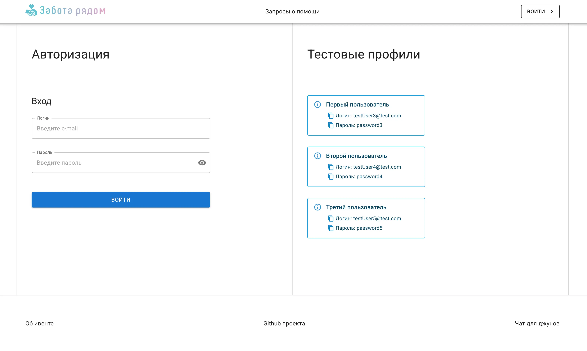
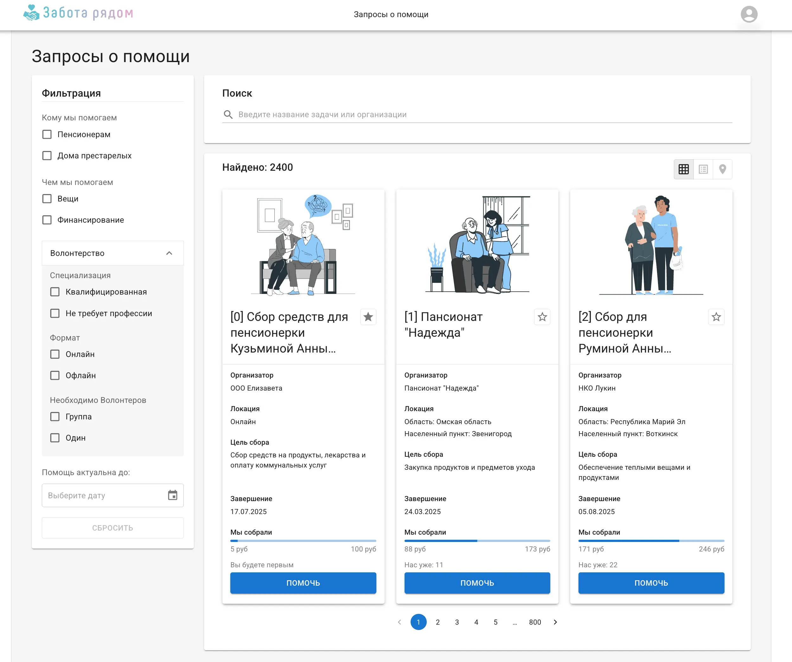
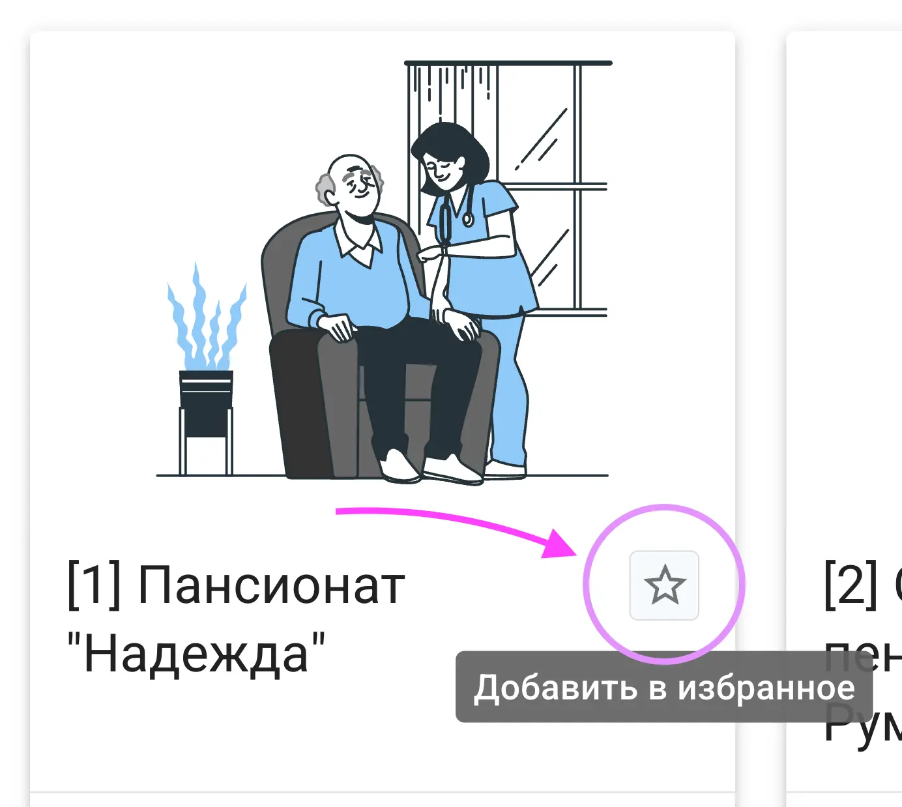
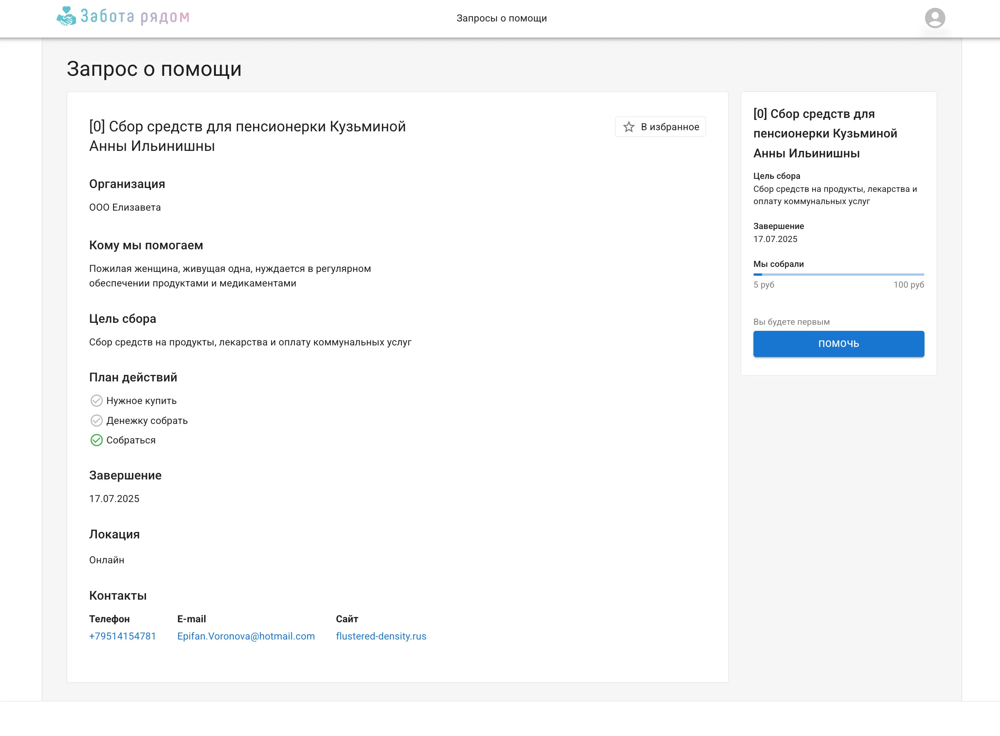
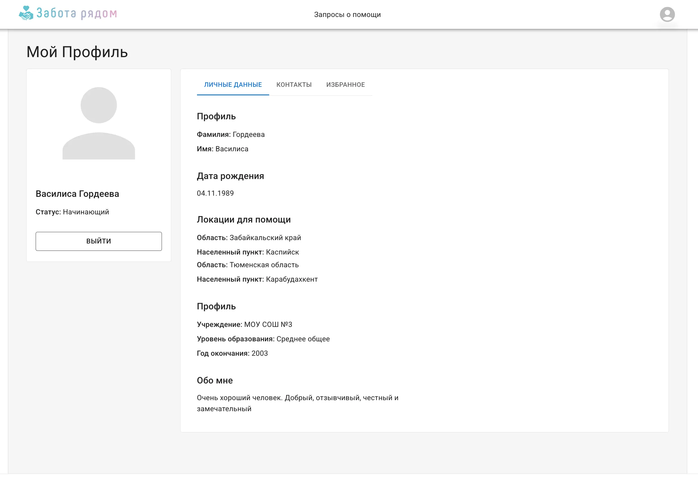
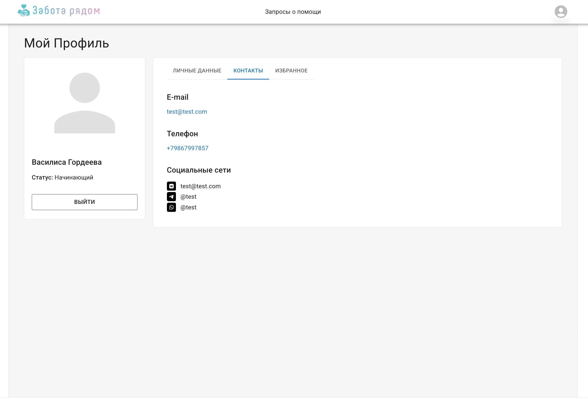
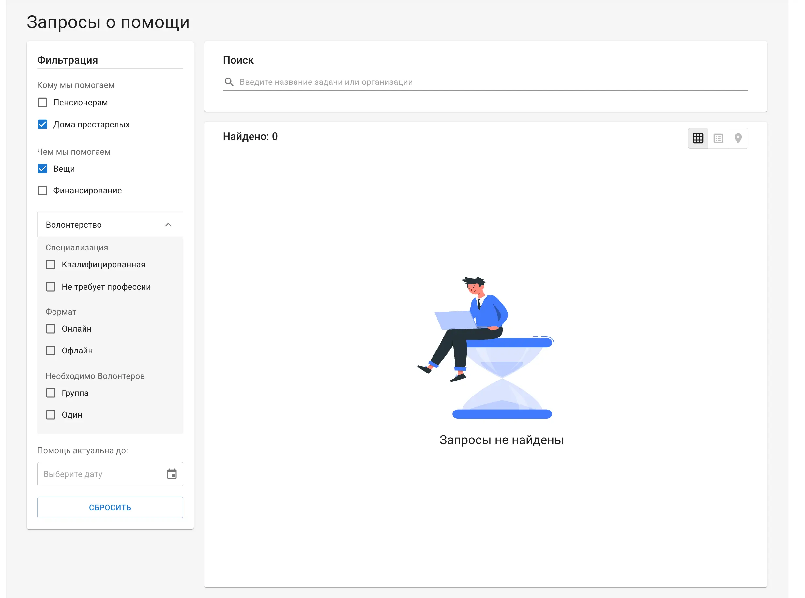
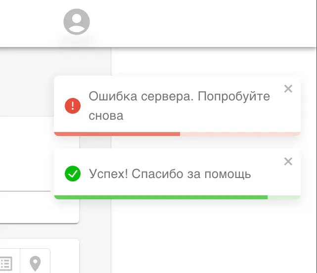

# Website with Help Requests for Elderly People (React/TS/MUI/Redux)

[LIVE DEMO LINK](https://help-requests-app.netlify.app/)

Users can access a catalog of help requests with search and filter options. They can contribute by clicking the "Contribute" button on a request card. Additionally, users can add requests to their favorites. The project includes login functionality via test profiles.

## Stack


## Features

- **Login** with test profiles
- **Request a catalog** with search, filters, and pagination
- Each **request card** includes "Contribute" and "Add to Favourites" buttons
- Clicking on a card opens the request details page
- **Profile menu** is available in the navigation bar
- **The profile page** has a tab for favorite requests

### What features work via API calls

- authentication
- getting help requests
- getting a single help request by id
- get user information for the profile page
- get a list of favourite requsts
- add/remove request to favourites

The project handles errors and empty search results using UI components and toast notifications.

### List of Pages

- Login
- Help request catalog
- Single request page
- User profile page

## Project UI

**Login Page**


**Request Catalog**


**Add to Favorites**



**Header Menu**


**Single Request Page**


**Profile Page (Tab 1)**


**Profile Page (Tab 2)**


**Profile Page (Tab 3)**


### Error Handling

**Errors**


**No Results Found**


**Toast Notifications**



## How to Run Locally

### Install Dependencies

```js
npm install

// or

yarn
```

### Start Local Server with Vite

```js
npm run dev

// or

yarn
```

#### Design and idea taken from [‘Charity React event’ 2024](https://github.com/nat-davydova/charity_event_back_oct2024/tree/main?tab=readme-ov-file)
