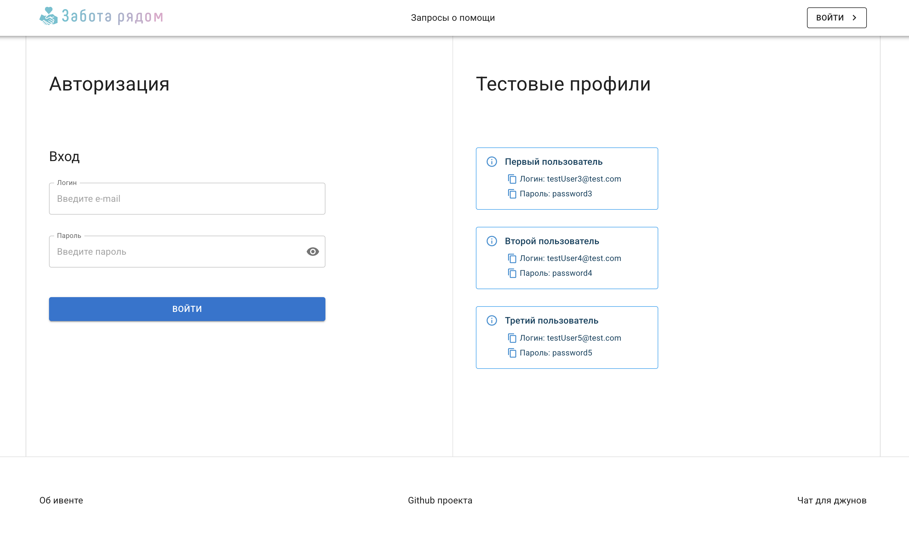
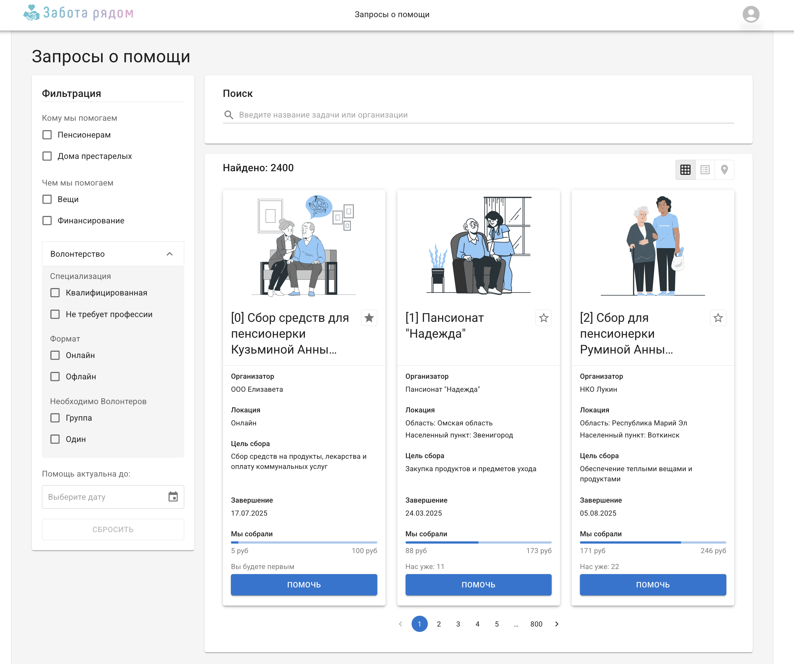
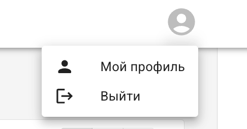
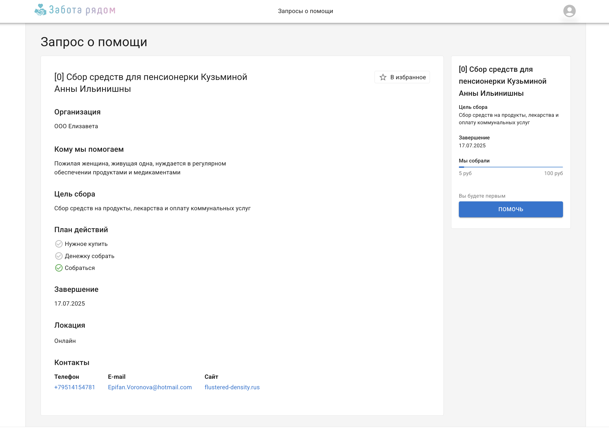
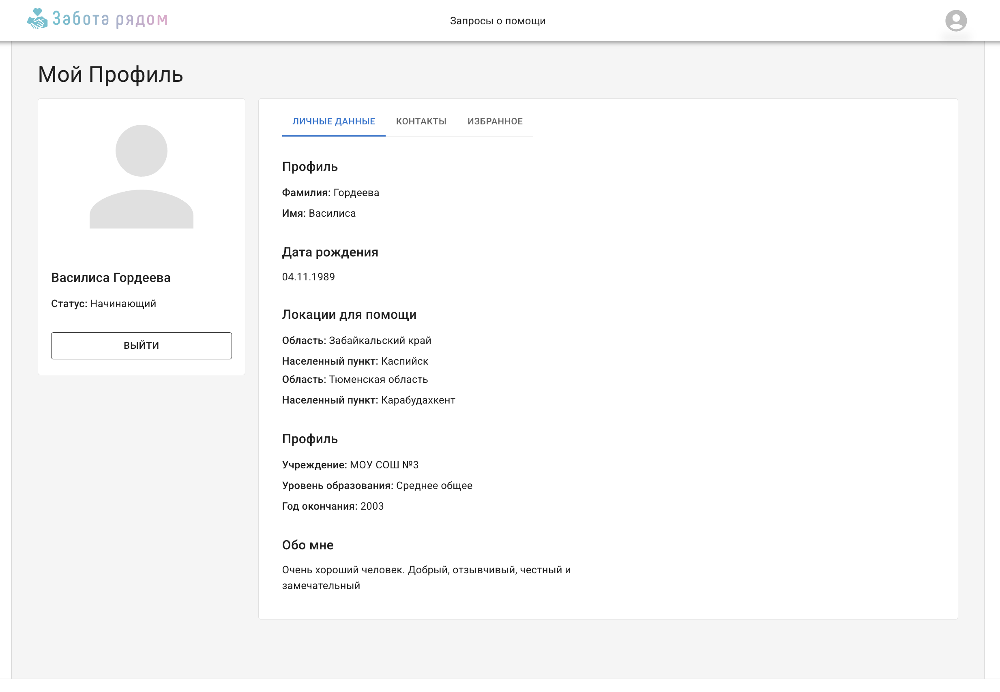
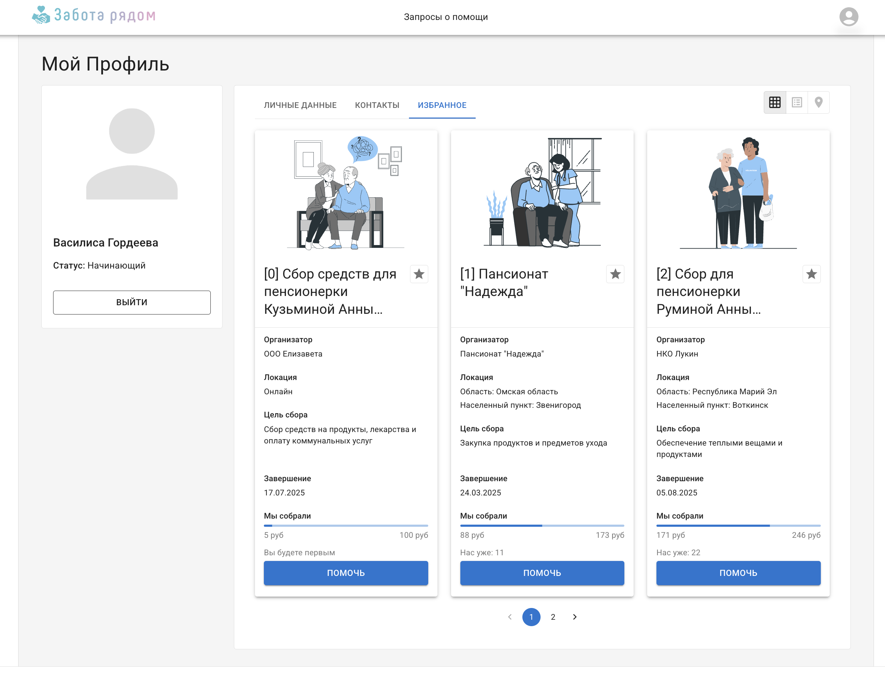
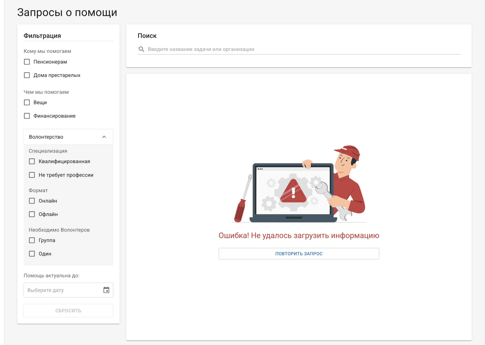
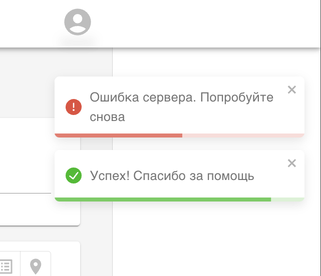

# Проект сайта с запросами о помощи для пожилых людей (React/TS/MUI/Redux)

Проект с логином в личный профиль. После входа попадаете на главную страницу - это каталог запросов о помощи с поиском и фильтрами. Есть возможность добавлять запросы в избранное. 

[ССЫЛКА НА ДЕПЛОЙ](https://help-requests-catalog.vercel.app/)

## Cтак


## Функционал

- **Логин** с помощью тестовых профилей
- **Каталог запросов** с поиском, фильтрами и пагинацией.
- На **карточках запроса** есть конопка "добавить в избранное" в виде звездочки
- Клик по карточке откроет страницу этого запроса
- **Меню профиля** открывается в строке навигации
- **Страница профиля** имеет вкладку с избанными запросами
- **Кнопка ВОЙТИ** отправляет запрос к API `api/contribution`

В проекте обрабатываются ошибки и пустые результаты с помощью UI компонент и тост-нотификаций

### Список экранов:

- логин
- каталог запросов о помощи
- страница одного запроса
- страница профиля юзера

## Скриншоты проекта

**Логин**



**Каталог запросов**


**Добавить в избранное**


**Меню в хедере**


**Страница Конкретного Запроса**


**Страница Профиля (1-я вкладка)**


**Страница Профиля (2-я вкладка)**


**Страница Профиля (3-я вкладка)**


## Обработки

**Ошибки**


**Нет результатов**


**Тосты**



## Как запустить локально

### Установка зависимостей

```js
npm install

// или

 yarn
```

### запуск локального сервера через Vite

```js
npm run dev

// или

 yarn
```

### Задание взято с ["Благотворительного React-ивента" 2024](https://github.com/nat-davydova/charity_event_back_oct2024/tree/main?tab=readme-ov-file)
